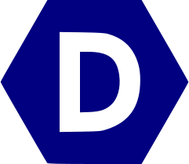
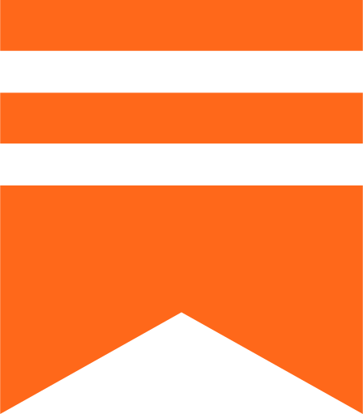

<article class="markdown-body entry-content container-lg f5" itemprop="text">
<!-- Cool font image from https://www.fontspace.com/aquire-font-f43735 -->

 
    
<h3 dir="auto"><strong>About Me</strong></h3>
<ul dir="auto">
<li> I tune AI systems until they behave - PyTorch internals, kernels, GPYs, and distributed training.</li>
</ul>
 
<h3 dir="auto"><strong>Profile Stats</strong></h3>
<table>
<thead>
<tr>
<th></th>
<th></th>
</tr>
</thead>
</table>

<h3 dir="auto"><strong>Credits</strong></h3>
<!-- <ul dir="auto"> -->
Thanks to the creators behind the GitHub README generators and stats tools that make developer profiles fun. 
<!-- Thanks to the creators behind the Github
<li><a href="https://github.com/anuraghazra">Anurag Hazra</a> for <a href="https://github.com/anuraghazra/github-readme-stats">github-readme-stats</a></li>
<li><a href="https://github.com/rahuldkjain">Rahul Jain</a> for <a href="https://github.com/rahuldkjain/github-profile-readme-generator">github-profile-readme-generator</a></li> -->
<!-- </ul> -->

<h3 dir="auto"><strong>Follow Me</strong></h3>
<!-- 
 -->
<!--  -->
<!--  -->

<!--
 -->
<!-- 

 -->

</article>

<!--
**iotaaxel/iotaaxel** is a ✨ _special_ ✨ repository because its `README.md` (this file) appears on your GitHub profile.

Here are some ideas to get you started:

- 🔭 I’m currently working on ...
- 🌱 I’m currently learning ...
- 👯 I’m looking to collaborate on ...
- 🤔 I’m looking for help with ...
- 💬 Ask me about ...
- 📫 How to reach me: ...
- 😄 Pronouns: ...
- ⚡ Fun fact: ...
-->
